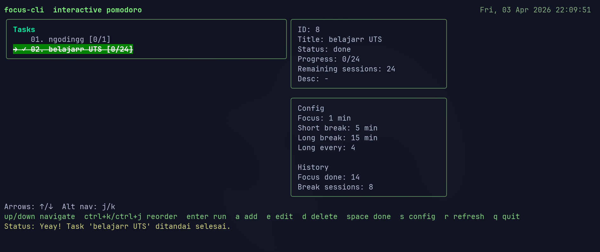
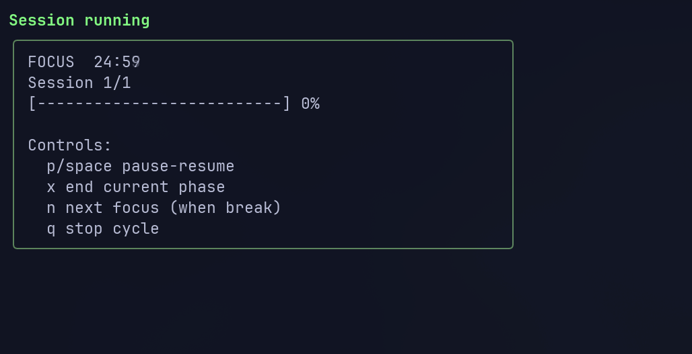

# focus-cli

Pomodoro app berbasis terminal Linux, ditulis dengan Go (hasil dari vibe coding dalam waktu semalam, shows its potential for personal projects).




## Fitur MVP

- Timer fokus dan break (short/long)
- Menjalankan beberapa sesi pomodoro sekaligus
- CRUD task (add, list, edit, delete)
- Menandai task selesai
- Menyimpan progress sesi pomodoro per task
- Konfigurasi durasi sesi
- Statistik sederhana
- Dashboard interaktif terminal
- Theme preset (sunrise, forest, mono)
- Keybinding customization via config
- Notifikasi sesi: warning sebelum waktu habis, fokus/break selesai, dan task selesai
- Save & resume progress timer per task (lanjut dari sisa waktu terakhir)

## 📅 Integrasi Google Calendar (GCal)

`focus-cli` mendukung integrasi dua arah dengan Google Calendar untuk mencatat sesi fokus pomodoro secara otomatis (Time Tracking) dan mengimpor daftar tugas (Task Import) secara asinkron.

> [!IMPORTANT]
> Untuk mulai menggunakan fitur ini, Anda perlu membuat kredensial API Google Anda sendiri secara mandiri. Silakan baca panduan lengkap di **[Panduan Setup Google Calendar](docs/gcal-setup.md)**.

### Fitur Utama Integrasi GCal:

1. **Sinkronisasi Tugas Asinkron (Mode TUI)**
   Saat integrasi GCal aktif (`gcal-enabled=true`), dashboard TUI akan otomatis mengimpor tugas baru saat startup. Anda juga dapat menekan tombol **`r`** untuk menyegarkan dan melakukan sinkronisasi ulang di background tanpa memblokir/membekukan UI.

2. **Dukungan Format Judul Kustom (Dinamis)**
   Anda dapat menulis detail sesi langsung di judul event Google Calendar dengan konvensi berikut:
   - **`[Focus/Break] Nama Tugas`** (misal: `[50/10] Menulis Laporan`): Mengatur durasi fokus 50 menit dan break 10 menit. Jumlah target sesi pomodoro akan dihitung dinamis berdasarkan durasi event GCal.
   - **`[N] Nama Tugas`** (misal: `[4] Belajar Go`): Mengatur target sesi pomodoro sebanyak `N` sesi secara eksplisit.
   - **Penyaringan Pintar**: Event dengan judul berawalan `[Done]`, `[Selesai]`, atau `Focus:` akan otomatis diabaikan.

3. **Pembaruan Status Selesai Otomatis**
   Menandai tugas selesai secara lokal (di CLI maupun TUI) akan memicu pembaruan judul event di Google Calendar secara asinkron menjadi berawalan `[Done] ` (misal: `[Done] [50/10] Menulis Laporan`).

4. **Penghapusan Tugas & Pencegahan Re-impor**
   Menghapus tugas lokal akan merekam ID event-nya ke daftar tombstone (`DeletedGCalEventIDs`) sehingga tugas yang sudah dihapus tidak akan diimpor ulang pada sinkronisasi berikutnya.

5. **Penanganan Error Graceful**
   Jika koneksi terputus atau terjadi kegagalan otentikasi Google API, aplikasi tidak akan macet/freeze. Semua kegagalan di latar belakang akan dicatat secara asinkron ke dalam berkas `~/.config/focus-cli/error.log` untuk kemudahan debugging.

### Perintah CLI GCal

Setelah menaruh file kredensial Anda, gunakan perintah berikut untuk otentikasi dan konfigurasi:

```bash
# Otentikasi dan login ke akun Google Calendar
focus gcal login

# Periksa status koneksi Google API
focus gcal status

# Aktifkan integrasi Google Calendar di aplikasi
focus config set --gcal-enabled on

# Jalankan sinkronisasi tugas secara manual
focus gcal sync

# Logout dan hapus token secara aman
focus gcal logout
```

## Build

```bash
go build -o focus-cli .
```

## Installation

Setelah build, buat symlink ke /usr/local/bin untuk akses global:

```bash
sudo ln -s $(pwd)/focus-cli /usr/local/bin/focus
```

Setelah itu, kamu bisa pakai command `focus` dari mana saja tanpa perlu prefix path.

## Command

```bash
focus help
```

## Mode Interaktif

Jalankan saja:

```bash
focus
```

Ini akan membuka dashboard interaktif dengan:

- navigasi task pakai `↑` dan `↓` (atau `k` dan `j`)
- pindah urutan task pakai `ctrl+j` dan `ctrl+k`
- tambah task dengan `a`
- edit task dengan `e`
- hapus task dengan `d`
- toggle selesai dengan `space`
- mulai pomodoro cycle dengan `enter`
- ubah config dengan `s`
- refresh data dengan `r`
- keluar dengan `q`

Theme bisa diganti dari form config (`s`) atau command CLI.

Saat sesi berjalan:

- `p` atau `space` untuk pause/resume
- `x` untuk mengakhiri sesi sekarang lalu masuk break
- `n` untuk lanjut ke sesi berikutnya setelah break
- `q` untuk menghentikan cycle dan kembali ke dashboard

### Task

```bash
focus task add "Belajar Go" --target 4 --desc "module concurrency"
focus task list
focus task edit 1 --title "Belajar Go Lanjut" --target 6 --completed 2
focus task done 1 true
focus task delete 1
```

### Config

```bash
focus config show
focus config set --focus 25 --short 5 --long 15 --long-every 4 --theme forest
focus config set --notifications on --notify-warning-before 5
focus config set --notify-desktop on --notify-sound on
focus config set --notify-log on --notify-log-path ~/.config/focus-cli/notifications.log
focus config notifications show
focus config notifications set --enabled on --warning-before 3 --desktop on --sound on --log off
focus config key show
focus config key set nav_up w
focus config key set nav_down s
focus config key set start_cycle enter
```

### Notifikasi

`focus-cli` mendukung notifikasi berikut:

- warning saat sesi hampir habis (default: 5 menit sebelum selesai)
- notifikasi saat sesi fokus selesai (mulai break)
- notifikasi saat break selesai (mulai sesi berikutnya)
- notifikasi saat seluruh sesi pada task selesai

Tipe notifikasi yang tersedia:

- desktop notification (Linux desktop environment)
- sound notification (bell terminal / suara)
- logging event notifikasi ke file

Konfigurasi cepat via command `config notifications`:

```bash
focus config notifications show
focus config notifications set --enabled on --warning-before 5
focus config notifications set --desktop on --sound on
focus config notifications set --log on --log-path ~/.config/focus-cli/notifications.log
```

Override sekali jalan saat run (tanpa mengubah config permanen):

```bash
focus run --task 1 --sessions 4 --notify-warning-before 2 --notify-sound off
```

#### Setup Sound Notification

Suara notifikasi sudah tersedia secara otomatis! Saat kamu pertama kali menjalankan aplikasi, file notifikasi akan otomatis dikonfigurasi.

**Bagaimana cara kerjanya:**
1. Saat aplikasi dijalankan, file `notification.wav` otomatis diekstrak ke `~/.config/focus-cli/`
2. Config notifikasi suara sudah otomatis menunjuk ke file tersebut
3. Kamu langsung bisa mendengar suara notifikasi

**Untuk menggunakan custom sound file:**

Edit `~/.config/focus-cli/config.json` dan ubah path `sound_file` ke file audio custom kamu:

```json
{
  "notifications": {
    "enabled": true,
    "sound": {
      "enabled": true,
      "sound_file": "/path/to/custom/notification.wav"
    }
  }
}
```

**Tips untuk mendengar suara:**
- Pastikan ffmpeg terinstall untuk audio playback: `pacman -S ffmpeg` (Arch) atau `apt install ffmpeg` (Debian/Ubuntu)
- Verifikasi volume system tidak muted: cek dengan `pactl list sinks` atau pengaturan audio
- Test ffplay with custom file: `ffplay -nodisp -autoexit /path/to/audio.wav`
- Jika audio masih tidak terdengar, check bahwa file path benar dan akses readable

### Timer

```bash
focus timer --minutes 25 --label "Deep Work"
```

### Jalankan Pomodoro

```bash
focus run --task 1 --sessions 4
```

### Shortcut Commands

```bash
focus focus
focus focus 4 --task 1
focus break
focus break long
focus t 15 Deep Work
focus a "Review PR"
focus ls
focus e 1 --title "Review PR Backend"
focus d 1
focus done 1
focus cfg
focus set focus 30
```

### Stats

```bash
focus stats
```

## Lokasi Data

Data disimpan di:

- `~/.config/focus-cli/tasks.json`
- `~/.config/focus-cli/config.json`
- `~/.config/focus-cli/history.json`
